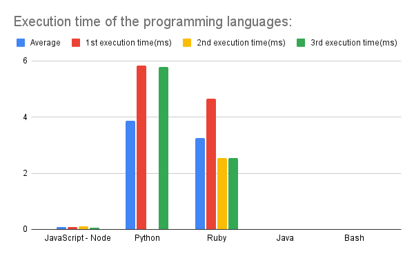

# Comparing Interpreters execution time

## In this repository, I will be comparing ç's performance against other interpreted languages like Python, JavaScript with Node, Bash, Ruby and Java.

### I will be creating two algorithms in each language:

The first algorithm just puts all numbers in an array in ascending order.

And the second one will calculate the average, the median and the mode between the numbers in the array.

### Then finally I will compare the execution time between the programming languages, executing each algorithm in each language three times and getting an average between the values to make a graph.

OBS: I just want to make it clear that I was running those codes in online code editors, so because of that they are a lot slower.
