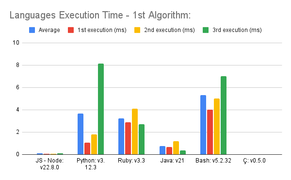
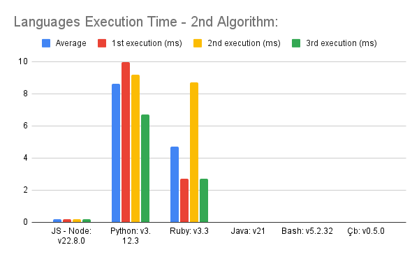

# Comparing Interpreter's execution time

## In this repository, I will be comparing Ç♭'s performance against against several other interpreted languages, including Python, Java, JavaScript (Node), Bash, and Ruby.

### To evaluate performance, I implement two algorithms in each language:

1. Insertion Sort: This algorithm sorts an array of numbers in ascending order using the insertion sort method.
2. Mode Calculation: This algorithm calculates the mode (the most frequently occurring number) within the array.

### Performance Evaluation Methodology:
To measure and compare the performance of each language, the following steps are taken:

- Each algorithm is executed 10 times with arrays of increasing sizes: 25 numbers, 100 numbers, and 1000 numbers.
- The average execution time and standard deviation are calculated for each set of runs.
- The collected data is used to generate two comparative graphs, one for each algorithm, to visualize the performance differences across languages.

> **NB**: Some of the languages  included in this comparison, such as Java and JavaScript, are not strictly interpreted. Instead, they utilize JIT (Just in Time) Compilation, which means that while most of the code is interpreted, performance-intensive tasks, such as loops, are directly compiled into machine code.

It is important to remember that all of those tests have been carried out in the same ASUSTeK COMPUTER INC. Vivobook_ASUSLaptop X1605ZA_X1605ZA with Debian 12.7.
