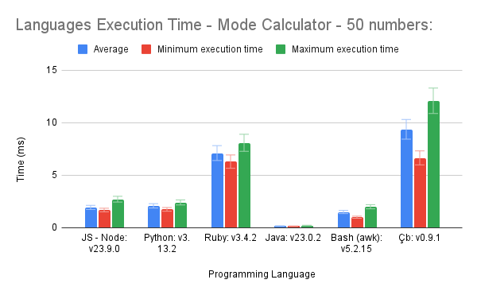
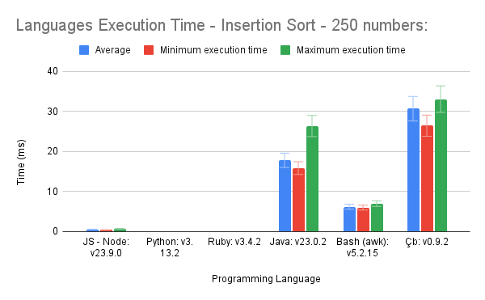
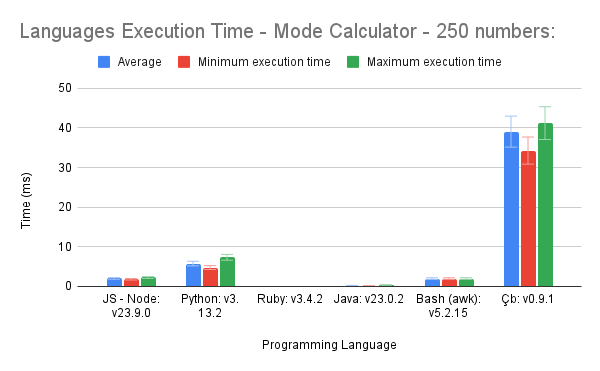
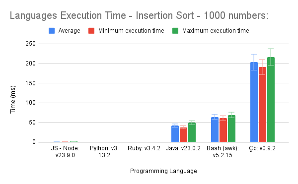

# Performance Comparison of Interpreted Languages

## Introduction
In the world of programming, the choice of language can significantly impact performance. This repository aims to evaluate and compare the execution times of various interpreted languages to provide insights for developers and break language stereotypes that may exist.

## Algorithms Implemented
To evaluate the performance, two algorithms were implemented in each language:

1. **Insertion Sort**: This algorithm sorts an array of numbers in ascending order using the insertion sort method.
2. **Mode Calculation**: This algorithm calculates the mode (the most frequently occurring number) within the array.

These algorithms were selected due to their common usage in programming and their time complexities of O(n²), which provide a good basis for performance evaluation.

### Performance Evaluation Methodology:
- Each algorithm is executed 10 times with arrays of increasing sizes: 25, 100, and 1000 numbers.
> **Note**: The time for reading the files and printing the output is included to represent a more realistic scenario
- The average execution time and standard deviation are calculated for each set of runs.
- The collected data is used to generate two comparative graphs for each algorithm, visualizing performance differences across languages.

> **NB**: Some of the languages included in this comparison, such as Java and JavaScript, are not strictly interpreted. Instead, they utilize JIT (Just in Time) Compilation, which means that while most of the code is interpreted, performance-intensive tasks, such as loops, are directly compiled into machine code.

*Ruby shows a significant gap between its maximum and minimum execution times, indicating variability in performance.*

*All languages, except Java, take longer to calculate the mode than sorting, highlighting Java's efficiency in this task.*

*Most JIT-compiled languages begin to leverage their optimization algorithms effectively at this size.*

*JavaScript and Python struggle more with mode calculation compared to their sorting performance, indicating potential inefficiencies.*

*The trends remain consistent; slower languages continue to lag, while faster ones maintain their speed, barely visible on the graph.*

*Interpreters like Çb, Bash, and even Java exhibit nearly linear scaling in execution times, demonstrating consistent performance.*

For those interested in the Çb project, feel free to explore it on [our GitHub page]([https://github.com/cedilha-lang]). Additionally, as a complement to our performance testing, we’ve implemented an algorithm that checks whether a given matrix is an identity matrix, which we used to compare the efficiency of different versions of our interpreter:

*The interpreter got a lot faster in version 0.7.8 as we made the interpreter capable of reading smaller files faster at the expense of reading multiple files or very large files less efficiently.*

## System Specifications
It is important to remember that all tests were carried out on the following system:
- **Model**: ASUSTeK COMPUTER INC. Vivobook_ASUSLaptop X1605ZA_X1605ZA
- **OS**: Debian 12.7

## Contributions
Contributions and suggestions for additional languages or algorithms are welcome!